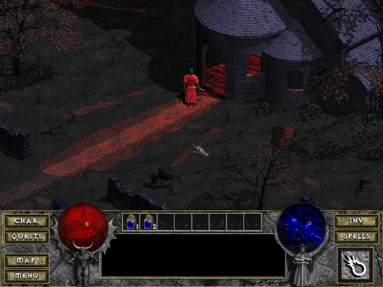
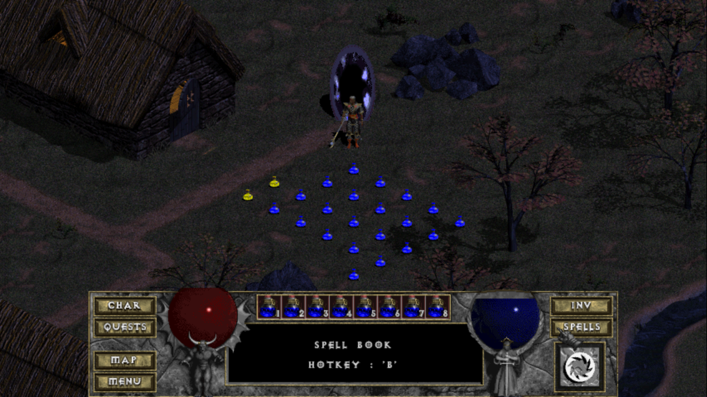

# pngs2cel

## Installation

```
git clone https://github.com/mewspring/pngs2cel
cd pngs2cel
go build
```

## Usage

### Single PNG image to CEL

```bash
# Convert a single PNG image into a corresponding CEL image.
./pngs2cel -o panel8.cel -pal_path /path/to/town.pal panel8.png
```

### Multiple PNG images to CEL

```bash
# Convert multiple PNG images into a corresponding CEL image.
./pngs2cel -o health_orb.cel -pal_path /path/to/town.pal health_0001.png health_0002.png health_0003.png
```



NOTE: The custom health and mana orb graphics were from [Qndel](https://github.com/qndel) (who in term got them from someone). If you know who, please let me know and I'll add the proper attribution.

### Multiple PNG images to CL2

```bash
# Convert multiple PNG images into a corresponding CL2 image.
./pngs2cel -cl2 -o portal2.cl2 -pal_path /path/to/town.pal portal_*.png
```



### Multiple PNG images for multiple direction to CL2 archive

```bash
# Convert multiple PNG images into a corresponding CL2 image.
./pngs2cel -cl2_archive -o wyvern_breathe.cl2 -pal_path /path/to/town.pal wyvern_breathe_{1,2,3,4,5,6,7,8}
```

[ animation graphics")](https://github.com/mewspring/pngs2cel/blob/master/inc/wyvern_cl2_graphics.mp4?raw=true "Click to view video")

NOTE: The Wyvern graphics is part of [Flare](https://flarerpg.org/).

Run [`wyvern/all.sh`](wyvern/all.sh) to generate the corresponding CL2 archive.
